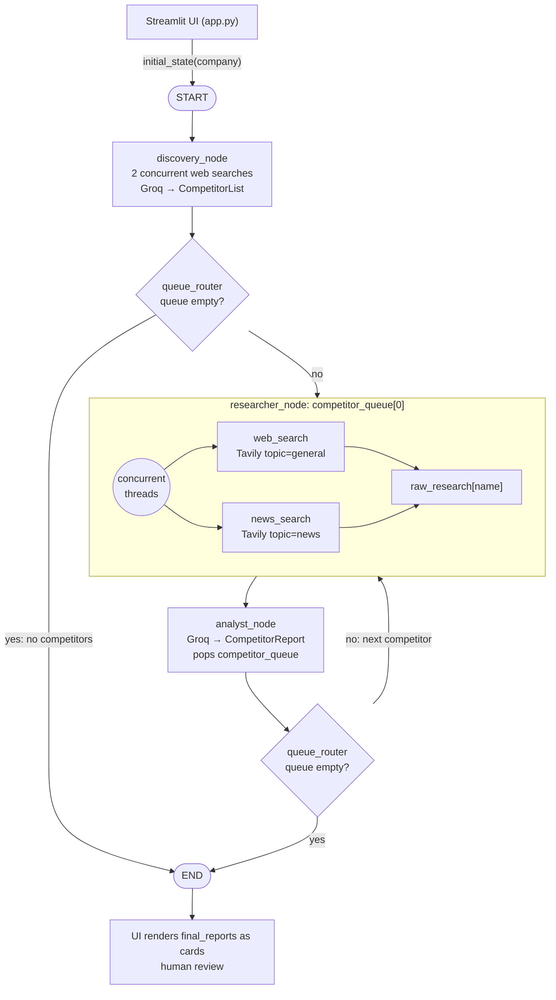

# Market Research Agent — Project Documentation

**Course:** TGA — Multiagent Coursework **Repository:** [https://github.com/sarumuga/market-research-agent](https://github.com/sarumuga/market-research-agent)

---

## 1. Project Overview

### What it is

The Market Research Agent is a multi-agent competitive market research pipeline. Given a company name, it:

1. **Discovers** that company's top 3 direct competitors
2. **Researches** each competitor via live web and news search
3. **Analyzes** the raw findings into a structured report (pricing model, core features, market positioning, recent news)
4. **Displays** the reports as expandable cards in a Streamlit UI, for a human to review

The system intentionally stops after generating reports. It does not write to a database, send emails, or take any automated action based on its findings — human review is the final step in the pipeline.

### Why it was built this way

Manual competitive research is slow: it means searching multiple sources, reading scattered information, and synthesizing it into a report by hand — a process that can take hours. It's also easy for an LLM alone to get this wrong, because an LLM's training data goes stale — pricing, product positioning, and recent announcements change constantly, and a model asked to describe a competitor from memory alone risks presenting outdated or invented information as fact.

This project is adapted from a reference architecture (the "Market Research Agent — Solution Kit," originally built around you.com + Groq) with the same core design goal: ground every claim in live search results rather than the LLM's training data, and make "I don't know" (rendered as "Data not found") an acceptable, expected answer rather than something the model has to guess around.

### Architecture

Three LangGraph nodes, orchestrated with a queue-based loop, sit behind a Streamlit front end:

**Discovery** runs two differently-phrased web searches concurrently, then asks the LLM (via structured output) to name the target's product category and its top 3 direct competitors — grounded strictly in what the search results actually contain. **Researcher** runs a web search and a news search concurrently for one competitor at a time. **Analyst** turns that raw text into a structured report using Groq's structured output, under an explicit "Data not found" guardrail for anything unsupported by the research. A queue router loops the Researcher → Analyst pair once per competitor, then ends the run.

### Stack

| Component | Choice | Role |
| --- | --- | --- |
| Orchestration | LangGraph | Multi-agent state graph, conditional routing, the queue loop |
| LLM glue | LangChain | Tool wrappers (`@tool`), `ChatGroq` integration |
| LLM | Groq — `openai/gpt-oss-120b` | Structured-output extraction, competitor discovery |
| Search | Tavily (`tavily-python`) | Live web + news search, grounding the pipeline in current data |
| UI | Streamlit | Company input, live progress log, expandable report cards |
| Schema | Pydantic | `CompetitorReport`, `CompetitorList` structured-output targets |

### Full technical write-up

A complete node-by-node breakdown, the state schema, the reducer mechanics behind the loop, and the full guardrail rationale are documented separately in [`docs/architecture.md`](https://github.com/sarumuga/market-research-agent/blob/main/docs/architecture.md) in the repository — that document is written directly from the final code and is the authoritative technical reference.

---

## 2. Datasets Used

This project does not use a static dataset. There is no CSV, corpus, or pre-collected training set involved.

Instead, the system retrieves **live web and news search results at runtime**, on demand, for whatever company name the user enters — via the **Tavily Search API**. This is a deliberate design choice, not an omission: the entire premise of the project is that competitive information (pricing, features, recent announcements) changes too frequently for a static dataset or an LLM's frozen training data to represent it reliably. Grounding the agent in live search results, rather than any dataset, is the mechanism that keeps its output current.

Per full research run (3 competitors), the pipeline makes:

- **8 Tavily searches** — 2 for Discovery (competitor identification), plus 2 per competitor (web + news) × 3 competitors
- **4 Groq LLM calls** — 1 for Discovery (structured competitor list), plus 1 per competitor (structured report)

A typical live run completes in roughly 13–17 seconds.

---

## 3. Prompts Used During Vibe Coding

Below are the substantive prompts given to Claude (both in planning conversation and to Claude Code for implementation), organized by build session. The full, unabridged build log lives in [`docs/prompts_log.md`](https://github.com/sarumuga/market-research-agent/blob/main/docs/prompts_log.md) in the repository.

### Session 1 — Planning

Provided the reference "Market Research Agent — Solution Kit" PDF and asked for a step-by-step build plan for a course-work multi-agent app, to be completed in a few hours.

### Session 2 — Scaffolding

Directed the creation of the repo structure (`graph/`, `tools/`, `prompts/`, `tests/`, `docs/`), dependency file, environment template, and the Tavily search wrapper layer (`tools/search_client.py`, `tools/search_tools.py`).

### Session 3 — State schema

Directed the design of `graph/state.py` — the shared `AgentState` and `CompetitorReport` schema — and creation of `CLAUDE.md` as a persistent project brief for Claude Code sessions.

### Session 4 — Graph nodes

> "Implement graph/nodes.py with three functions: discovery_node, researcher_node, and analyst_node, operating on AgentState. Use the web_search and news_search tools. Use ChatGroq with .with_structured_output(CompetitorReport) for the analyst node. Follow the guardrails and status_log conventions described in CLAUDE.md."

### Session 5 — Router, graph wiring, UI

> "Build these files as well: router.py, build_graph.py, app.py."

A live run in this session surfaced a real integration bug: Groq returned a 404 for the model named in the reference kit (`llama-3.3-70b-versatile`) because it had been retired. This was resolved by listing available models on the account's key and switching to `openai/gpt-oss-120b`, made configurable via a `GROQ_MODEL` environment variable.

### Session 6 — Closing README/implementation gaps

> "Fix these gaps between README.md and the actual implementation: (1) correct the model reference to openai/gpt-oss-120b; (2) in researcher_node, run the web_search and news_search calls concurrently instead of sequentially, and update the README's 'parallel' claim to match reality once it's true; (3) move the analyst system prompt out of graph/nodes.py into prompts/analyst_prompt.py and import it; (4) add a minimal smoke test in tests/test_graph_smoke.py that runs the graph and asserts final_reports contains 3 CompetitorReport entries."

### Session 7 — Discovery quality

> "Do the discovery improvement first."

This one-line prompt followed a diagnosis (see Iterations, below) of why Discovery's first-pass competitor picks were poor.

### Session 8 — Architecture write-up

> "Write docs/architecture.md documenting the actual current implementation (read the real code — don't just restate CLAUDE.md, since some things there are already stale)," followed by a specified structure (overview, diagram, node-by-node breakdown, why the loop works, guardrails, human-in-the-loop boundary, deviations from the kit).

Follow-up: *"Can you make the architecture a mermaid diagram."*

---

## 4. Iterations Tried

### 4.1 Search provider: you.com → Tavily

The reference kit specified you.com as the search API. This was swapped for **Tavily** early, before any code was written, for practical reasons: Tavily has a more accessible free tier and a simpler API, and its `topic="general"` / `topic="news"` parameter maps directly onto the kit's web-search / news-search split without needing two separate endpoints. The search layer was deliberately built behind a `SearchClient` class interface specifically so this kind of provider swap wouldn't require touching the graph or tool layers.

### 4.2 LLM model: Llama 3.3 70B → gpt-oss-120b

The reference kit specified Groq's Llama 3.3 70B. The first live end-to-end run failed with a 404 `model_not_found` error — the model had been retired on Groq since the kit was written. The available models on the account's key were listed, and `openai/gpt-oss-120b` was selected as the strongest general-purpose model available, with confirmed support for both structured output and tool calling (required for `.with_structured_output(CompetitorReport)`). This was made configurable via a `GROQ_MODEL` environment variable rather than hardcoded, so the model choice can be changed without a code change.

### 4.3 Sequential → concurrent search

The initial `researcher_node` ran its web search and news search one after another. Since the two calls are independent network requests with no data dependency between them, they were refactored to run concurrently via a 2-worker `ThreadPoolExecutor`. Verified with two mocked searches that each sleep 1 second: the node completed in \~1.0s concurrently versus \~2.0s sequentially. A live Tavily call for one competitor took approximately 1.7 seconds. The same concurrency pattern was applied to Discovery's two competitor-identification queries.

### 4.4 Discovery quality — the most substantial iteration

This is the clearest example of a genuine before/after improvement in the project, worth highlighting in detail.

**Baseline behavior** (single search query: *"top competitors and alternatives to X"*):

| Company | Baseline competitors returned |
| --- | --- |
| Notion | Airtable, Craft Agents, Scribe |
| Figma | Canva, Framer, Sketch |
| Slack | social.plus, Granola, Glue |
| Stripe | Moneris, Plexo, Trace Finance |
| Zoom | Webex, Whereby, LiveKit |
| Canva | Stability AI, Bending Spoons, Juicebox |

**Diagnosis:** the single search query was consistently dominated by one type of source — aggregator "alternatives" listicles that surface niche startups ahead of well-known direct competitors. Because the prompt instructed the model to use only names from the search results and to prefer the most direct competitor first, the model faithfully reproduced the listicle's own ordering rather than reasoning about actual market competition. A second, separate problem surfaced too: "Notion" the productivity tool and "Notion" the smart-lock company are different entities that share a name, creating a name-collision risk for Discovery.

**Fix applied** (in `graph/nodes.py`):

- Two differently-phrased search queries ("X top competitors" and "best X alternatives compared") run concurrently and their results are combined, so no single listing site's ordering dominates the evidence
- The structured-output schema (`CompetitorList`) gained a `category` field placed *before* `competitors`, forcing the model to first state the target company's product category and customer base — this both resolves same-name collisions and anchors competitor selection in "same product, same customer" logic rather than loose association
- The selection prompt was rewritten as explicit steps and rules: identify the product and resolve name collisions first, then prefer established products that appear across multiple sources (not just one), explicitly avoid copying a single site's ranking order, and exclude sub-products, subsidiaries, and integrations/add-ons of the target company

**Result after the fix:**

| Company | Post-fix competitors returned |
| --- | --- |
| Notion | Airtable, Coda, ClickUp |
| Figma | Sketch, Adobe XD, InVision |
| Slack | Microsoft Teams, Mattermost, Rocket.Chat |
| Stripe | Adyen, PayPal (Braintree), Checkout.com |
| Zoom | Microsoft Teams, Google Meet, Cisco Webex |
| Canva | Adobe Express, Visme, Crello/VistaCreate |

These are recognizable, direct, well-known competitors in every case — a clear qualitative improvement over the baseline. The fix was verified for consistency (a re-run produced the same picks), tested against an additional company not in the original baseline (Linear → Jira, Shortcut, ClickUp), and confirmed to still degrade gracefully on nonsense input (a made-up company name correctly ends the run with zero competitors found, rather than hallucinating some). The cost of this improvement is one additional Tavily search per run (2 Discovery searches instead of 1).

### 4.5 Failure handling for the Analyst node

An additional robustness pass was made after the initial implementation: if the Groq call for a given competitor's report fails for any reason (rate limit, malformed response, network error), the Analyst node now catches the exception and emits a placeholder report with every field set to "Data not found," then continues the loop — rather than letting one failed API call abort the entire run and lose all previously completed reports.

### 4.6 Prompt/code organization refactor

The analyst system prompt was initially written inline inside `graph/nodes.py`. It was later extracted into its own module (`prompts/analyst_prompt.py`) so the guardrail language — the part most likely to need review or iteration — can be read and edited independently of the graph logic. The Discovery prompt remained in `nodes.py` since it is more tightly coupled to the node's post-processing logic (dedup, exclusion, capping).

---

## 5. Learnings and Observations

**Reference architectures age faster than you'd expect.** The kit this project was built from specified a model (Llama 3.3 70B on Groq) that had already been retired by the time of implementation — a reminder that any AI-tooling reference material, including one written recently, can be stale by the time you actually build against it. The fix was straightforward once diagnosed (list available models, pick a comparable one, make it configurable), but it's a concrete example of why treating a reference kit as a starting point rather than a literal spec mattered in practice.

**The LangGraph reducer pattern is the single most important — and least obvious — mechanism in a looping multi-agent graph.** By default, when a node returns a value for a state key, LangGraph *overwrites* the previous value. For a linear pipeline that's fine. But this project loops the Researcher → Analyst pair once per competitor, and each Analyst pass only returns *its own* new report. Without explicitly annotating `final_reports` and `status_log` as `Annotated[list, operator.add]`, each loop iteration would silently overwrite the previous competitor's report instead of appending to it — the final output would only ever contain the *last* competitor processed, with no error or warning to indicate anything was wrong. Understanding this distinction — which state fields should overwrite versus which must accumulate — is what makes a looping agent graph work correctly rather than fail silently.

**Grounding constraints work best when "no answer" is an explicit, legitimate output.** The single guardrail doing the most work in this system is simple: the Analyst prompt tells the model to write "Data not found" for any field the research doesn't support, and the schema's field descriptions repeat that instruction. Without this, an LLM asked to fill in every field of a structured schema tends to fill gaps from its training data rather than leave them empty — and a structured-output field makes an invented answer look exactly as authoritative as a real one. Giving the model explicit permission to say "I don't know" turned out to matter more than any instruction telling it not to invent things.

**A single search query is not enough to trust an LLM's synthesis of it.** The Discovery quality problem (Section 4.4) wasn't really a prompting failure — the model was doing what it was told, faithfully. The actual problem was that a single search query returned a narrow, biased slice of the web (one aggregator site's listicle), and the model had no way to know that. The fix that actually worked was mostly about *evidence gathering* — running two differently-angled queries and combining them — rather than further prompt engineering on top of biased evidence. This was a useful, generalizable lesson: when a retrieval-augmented agent's output quality is poor, it's worth checking what it retrieved before assuming the problem is in how it reasons about what it retrieved.

**Concurrency is easy to get right when the underlying calls are already independent.** Both the Researcher's web/news split and Discovery's two-query approach were straightforward to parallelize with a plain `ThreadPoolExecutor`, because neither call depends on the other's result. This kept the system simple — no `asyncio` refactor of the whole pipeline was needed for a modest, measurable speedup, since the underlying LangGraph graph and the Tavily client are both synchronous.

**Working with an AI coding assistant surfaces integration problems fast, but architectural quality still requires deliberate iteration.** The overall build moved quickly — a working end-to-end pipeline was live within a few hours — and Claude Code caught and fixed real issues (the retired model, the sequential-search inefficiency, the doc/implementation drift) when explicitly asked to check for them. But the most substantial quality improvement in the project — the Discovery competitor-selection fix — required a human first noticing that the *output* was subtly wrong (real but obscure competitors, not clearly incorrect) and then directing a specific diagnosis and fix. The tool accelerated implementation significantly; it did not replace the judgment needed to notice that "technically working" and "actually good" were two different bars.